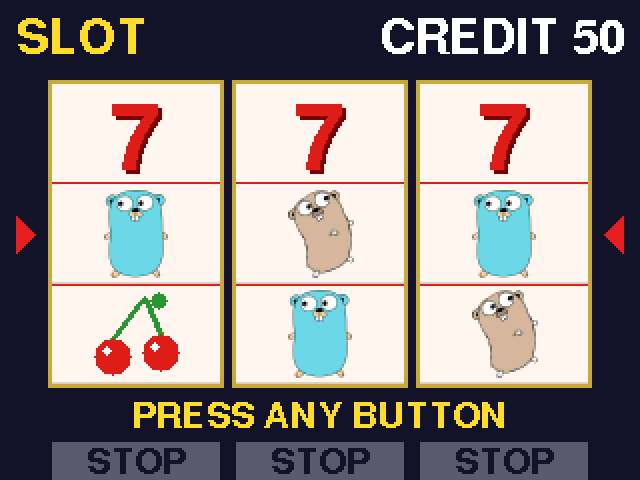

# TinyGo Slot Game

M5Stack Basic と Wio Terminal で遊べる、3リールの目押しスロットマシンです。TinyGo で書いています。



- 本体の3つのボタンが、それぞれ左・中・右リールのストップボタンになります
- 乱数は使いません。リール配列は固定で、止めるタイミングだけで結果が決まります（目押し）
- ベルとブドウの図柄は Go の Gopher です

## 対応ボード

| ボード | ターゲット | ストップボタン（左 / 中 / 右） |
| --- | --- | --- |
| M5Stack Basic / Gray | `m5stack` | 前面の A / B / C |
| Wio Terminal | `wioterminal` | 上面の KEY_C / KEY_B / KEY_A（画面側から見て左から） |

## 必要なもの

- TinyGo 0.42.0
- Go 1.25〜1.27（TinyGo 0.42.0 の要件）

## ビルドと書き込み

```sh
go mod tidy

# M5Stack
tinygo flash -target=m5stack -port=/dev/ttyUSB0 .

# Wio Terminal
tinygo flash -target=wioterminal .
```

ポート名は環境に合わせて変えてください。Wio Terminal で書き込みに失敗するときは、電源スイッチを下に素早く2回スライドしてブートローダーに入れてから、もう一度実行します。

書き込まずにビルドだけ確かめるときは `tinygo build -target=m5stack -size short -o slot_m5stack.bin .` のようにします。

## 遊び方

1. どのボタンでもスタートします。1ゲームで 3 クレジットを使います
2. 回転中にボタンを押すと、対応するリールが止まります。止める順番は自由です
3. 3本とも止まったら、中段（赤い線と ◀▶ で挟まれた段）の1ラインで役を判定します
4. クレジットが 3 未満になると GAME OVER です。ボタンを押すと 50 クレジットに戻ります

ボタンを押してから最大1コマ滑って止まります。狙った図柄が中段の少し上に来たときに押すのがコツです。

### 配当表

上から順に判定し、最初に当てはまった役だけを払い出します。

| 役（中段） | 配当 |
| --- | --- |
| 7 ・ 7 ・ 7 | 100 |
| BAR ・ BAR ・ BAR | 50 |
| 茶色の Gopher × 3 | 15 |
| チェリー × 3 | 10 |
| 青い Gopher × 3 | 8 |
| 左リールだけチェリー | 2 |

## ファイル構成

| ファイル | 内容 |
| --- | --- |
| `main.go` | メインループ（TinyGo 用） |
| `board_m5stack.go` / `board_wioterminal.go` | ボードごとの初期化とボタンの割り当て |
| `slot.go` | ハードウェアに依存しない部分（図柄、リール、役判定、画面描画） |
| `slot_test.go` | ホストの Go で動くテスト |
| `tools/gensprite/` | 画像を図柄用スプライトに変換するツール |
| `img/` | Gopher の元画像と生成済みスプライト |
| `M5Stack Basic スロットマシン 実装仕様書（TinyGo）.md` | 実装仕様書 |

## 開発

ゲーム本体はハードウェアに依存しないので、PC の Go でテストできます。

```sh
go test .

# 画面イメージを preview_*.png に書き出す
go test -run TestPreview -preview .
```

Gopher の画像を差し替えたら、`go generate` でスプライト（`img/*.rgba`）を作り直します。SVG を PNG にするために `rsvg-convert` が必要です。

色が反転して表示されるときは、使っているボードの `board_*.go` にある `displayInversion` を切り替えてください。

## クレジット

The Go gopher was designed by [Renée French](https://reneefrench.blogspot.com/), licensed under [CC BY 4.0](https://creativecommons.org/licenses/by/4.0/).
